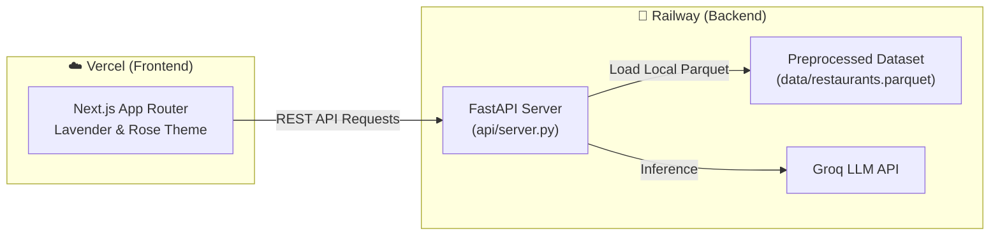

# 🚀 Deployment Guide — AI Restaurant Recommendation System

> **Architecture:** Split Architecture (Railway Backend API + Vercel Next.js Frontend)  
> **Repository:** `TheAlphaBA/Restaraunt-finder`  
> **Backend:** FastAPI + Uvicorn on Railway (Python 3.11)  
> **Frontend:** Next.js (React + TypeScript) on Vercel  

---

## 📐 System Architecture

---

## 🚂 1. Backend Deployment (Railway)

The backend code is already prepared and pushed to your repository root (`Dockerfile`, `railway.toml`, `api/server.py`, `data/restaurants.parquet`).

### Step-by-Step:
1. Log in to [Railway.app](https://railway.app)
2. Click **"New Project"** → select **"Deploy from GitHub repo"**
3. Select your repository: `TheAlphaBA/Restaraunt-finder`
4. Railway will automatically detect the `Dockerfile` and `railway.toml`.
5. Under **Variables** in your Railway service, add:
   - `GROQ_API_KEY`: `your_groq_api_key_here`
6. Under **Settings → Networking**, click **"Generate Domain"** (e.g. `https://restaraunt-finder-production.up.railway.app`).
7. Test the health check in your browser:
   `https://<your-railway-domain>/health`  
   *(Expected response: `{"status":"healthy","dataset_loaded":true,"restaurant_count":41410}`)*

---

## ⚡ 2. Frontend Deployment (Vercel)

The Next.js frontend is prepared in the [`frontend/`](./frontend/) directory.

### Step-by-Step:
1. Log in to [Vercel.com](https://vercel.com)
2. Click **"Add New..."** → **"Project"**
3. Import your GitHub repository: `TheAlphaBA/Restaraunt-finder`
4. Under **Configure Project**:
   - **Framework Preset**: Next.js (auto-detected)
   - **Root Directory**: Click *Edit* and select **`frontend`** 👈 *(CRITICAL)*
5. Under **Environment Variables**, add:
   - **Name**: `NEXT_PUBLIC_API_URL`
   - **Value**: `https://<your-railway-domain>.up.railway.app` *(Your Railway domain from Step 1)*
6. Click **"Deploy"**.

---

## 🔄 3. Update Backend CORS (Final Step)

Once Vercel gives you your live frontend URL (e.g. `https://restaraunt-finder.vercel.app`):

1. Go back to **Railway.app** → select your project service.
2. Under **Variables**, add:
   - `FRONTEND_URL`: `https://restaraunt-finder.vercel.app`
3. Railway will automatically redeploy with CORS permissions enabled for your Vercel frontend.

---

## 🛠️ Verification Checklist

- [x] Preprocessed dataset (`data/restaurants.parquet`) bundled to prevent RAM OOM crashes.
- [x] FastAPI REST endpoints available at `/api/locations`, `/api/cuisines`, `/api/recommend`.
- [x] Next.js frontend built and validated in `frontend/`.
- [x] Git commits pushed to `main` branch on GitHub.
